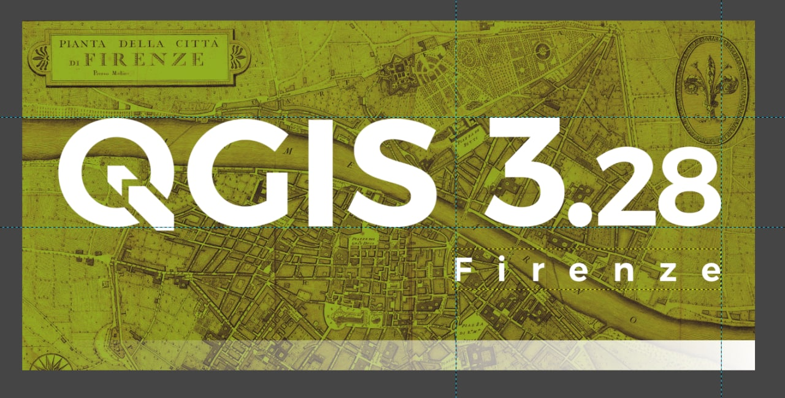

# splashscreen_QGIS328_Firenze

Splashscreen QGIS 3.28 Firenze - Backgrounds and GIMP project

## background image requirements

1. license in the Public domain (required); 
2. high resolution image (required); 
3. represents a history map of the city of Florence;

## documentation

1. link to the image;
2. link to the license;
3. link to image description

## First draft

- Image

- Link

<https://commons.wikimedia.org/wiki/File:1847_Molini_Pocket_Map_of_Florence_(Frienze),_Italy_-_Geographicus_-_Firenze-molini-1847.jpg>

- Screensplash

- Description

A rare and extraordinary 1847 map of Firenze or Florence, Italy by Giuseppe Molini. This magnificently engraved map was originally drawn in 1731 by the Florentine architect Ferdinando Ruggieri. Oriented to the south, the map covers the old walled center of Florence as it extends on both sides of the Arno River. Offers superb detail at the street and building level showing towers, gardens, piazzas, palaces and in many cases individual trees. The title appears in a decorative frame in the upper left quadrant. Upper right quadrant features the lily symbol of Florence. An allegorical title cartouche in the lower left quadrant depicts a partially disrobed man leaning against a large urn with a lion, a popular Florentine icon called Marzocco, as his companion. Behind him are tall reeds partially blocking a magnificent view of the Palazzo Vecchio and the Duomo. Though printed in 1847 this map has been prepared in the 17th century style, by copperplate engraving, on thick laid paper. Firenze in 1847 was on the cusp of political transformation. One year following the production of this rare map the Grand Duke of Tuscany, responding to political demonstrations throughout Florence, granted a Tuscany its first constitution.

- Project GIMP

[here](projectGIMP/splash328.xcf)

## Second draft

