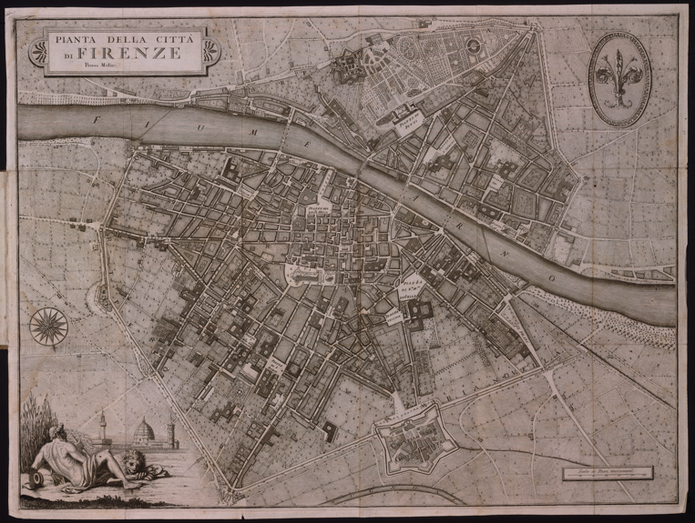
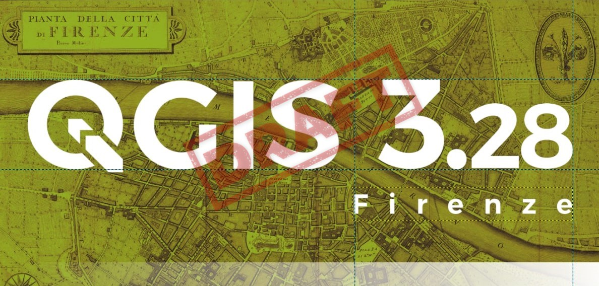
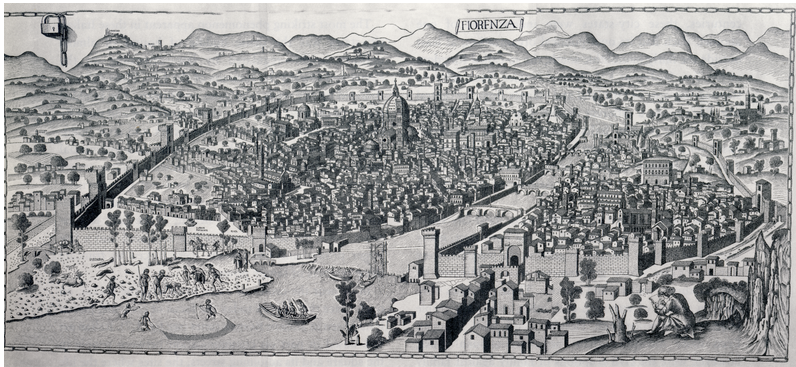
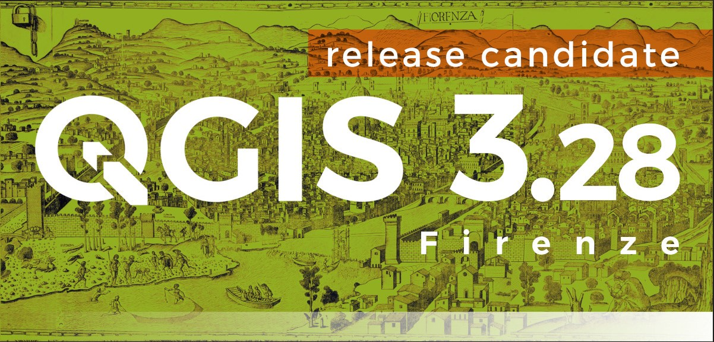

# splashscreen_QGIS328_Firenze

Splashscreen QGIS 3.28 Firenze - Backgrounds and GIMP project

----------------> UNDER CONSTRUCTION <--------------------------

<!-- TOC -->

- [splashscreen_QGIS328_Firenze](#splashscreen_qgis328_firenze)
  - [background image requirements](#background-image-requirements)
  - [documentation](#documentation)
  - [repository folders](#repository-folders)
- [Draft](#draft)
  - [First draft (Totò)](#first-draft-totò)
  - [Second draft (Iacopo)](#second-draft-iacopo)
  - [Third draft (Stefano)](#third-draft-stefano)

<!-- /TOC -->

## background image requirements

1. license in the Public domain (required); 
2. high resolution image (required) ~ 3000 px wide; 
3. represents a history map of the city of Florence;
4. The writing Firenze clearly in evidence in the image;

## documentation

1. link to the image;
2. link to the license;
3. link to image description

## repository folders
1. **imagesHR**: contains high resolution images;
2. **imagesLR**: Contains low resolution images as screenshots and splashscreen examples
3. **projectGIMP**: contains the GIMP project files

# Draft 

## First draft (Totò)

- Image

- Link

<https://commons.wikimedia.org/wiki/File:1847_Molini_Pocket_Map_of_Florence_(Frienze),_Italy_-_Geographicus_-_Firenze-molini-1847.jpg>

- Splashscreen

- Description

A rare and extraordinary 1847 map of Firenze or Florence, Italy by Giuseppe Molini. This magnificently engraved map was originally drawn in 1731 by the Florentine architect Ferdinando Ruggieri. Oriented to the south, the map covers the old walled center of Florence as it extends on both sides of the Arno River. Offers superb detail at the street and building level showing towers, gardens, piazzas, palaces and in many cases individual trees. The title appears in a decorative frame in the upper left quadrant. Upper right quadrant features the lily symbol of Florence. An allegorical title cartouche in the lower left quadrant depicts a partially disrobed man leaning against a large urn with a lion, a popular Florentine icon called Marzocco, as his companion. Behind him are tall reeds partially blocking a magnificent view of the Palazzo Vecchio and the Duomo. Though printed in 1847 this map has been prepared in the 17th century style, by copperplate engraving, on thick laid paper. Firenze in 1847 was on the cusp of political transformation. One year following the production of this rare map the Grand Duke of Tuscany, responding to political demonstrations throughout Florence, granted a Tuscany its first constitution.

- Project GIMP

[here](projectGIMP/splash328.xcf)

↑ [come back up](#splashscreen_qgis328_firenze) ↑

## Second draft (Iacopo)

- Image

- Link

<https://commons.wikimedia.org/wiki/File:Florence_-_View_with_Chain_-_woodcut.png#filehistory>

- Splashscreen

- Description

The Veduta della Catena (Chain Map) is the first general view of a city drawn according with the principle of central perspective. The original version was probably realised by Francesco di Lorenzo Rosselli in 1471-72, but was unfortunately lost. The actual copies are old reproductions preserved in various historical archives.
The view shows a detailed image of the city from the Monteoliveto monastery. It constitutes a milestone in the history of cartographic representation as first attempt to use the mathematical theories by Paolo dal Pozzo Toscanelli and the correlated experience of Leon Battista Alberti in formalizing the rules of central perspective as written in the text “De pictura” in 1435. Substantially the rules of triangulation and the concept of representation in scale are already present in a nutshell in this work, making it of capital importance for the geographical representation.

- Project GIMP

[here](projectGIMP/splash328Iacopo.xcf)

↑ [come back up](#splashscreen_qgis328_firenze) ↑

## Third draft (Stefano)

- Image

- Link

<>

- Splashscreen

- Description

xxxx

- Project GIMP

[here](projectGIMP/splash328Stefano.xcf)

↑ [come back up](#splashscreen_qgis328_firenze) ↑
