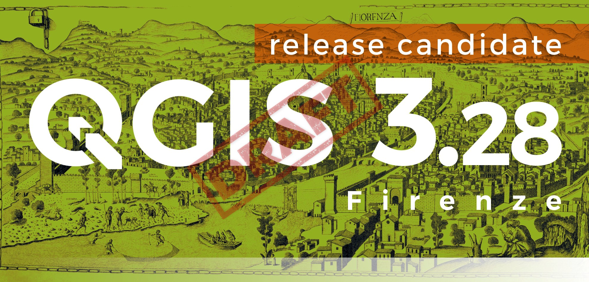
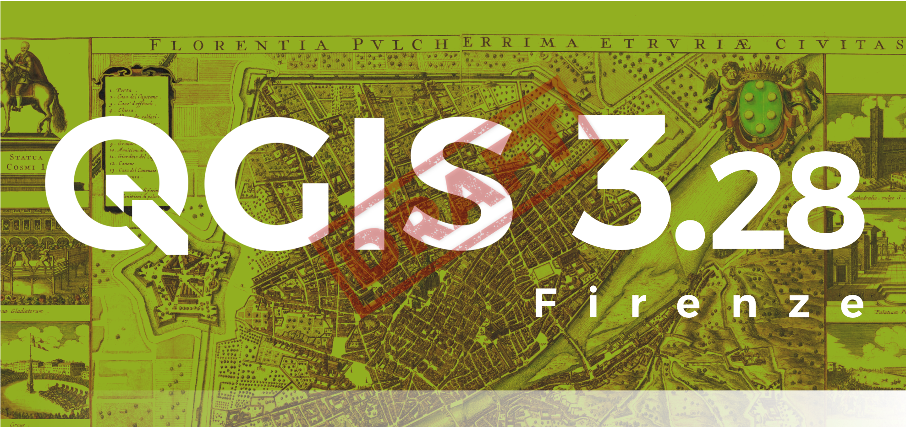
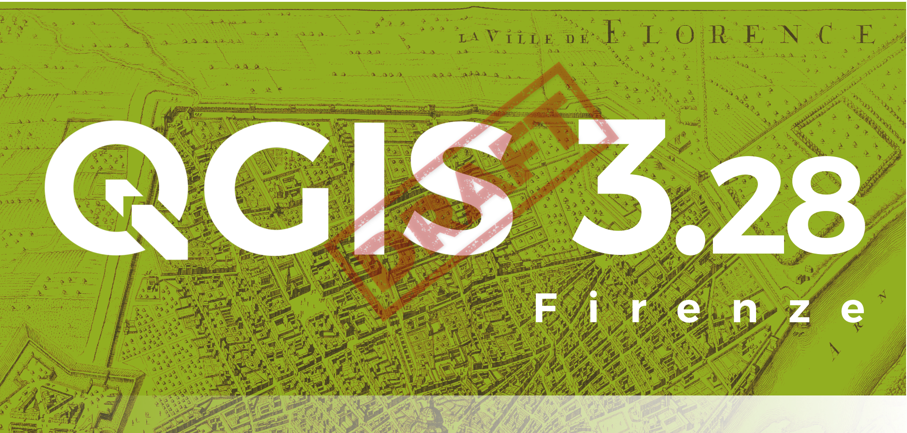
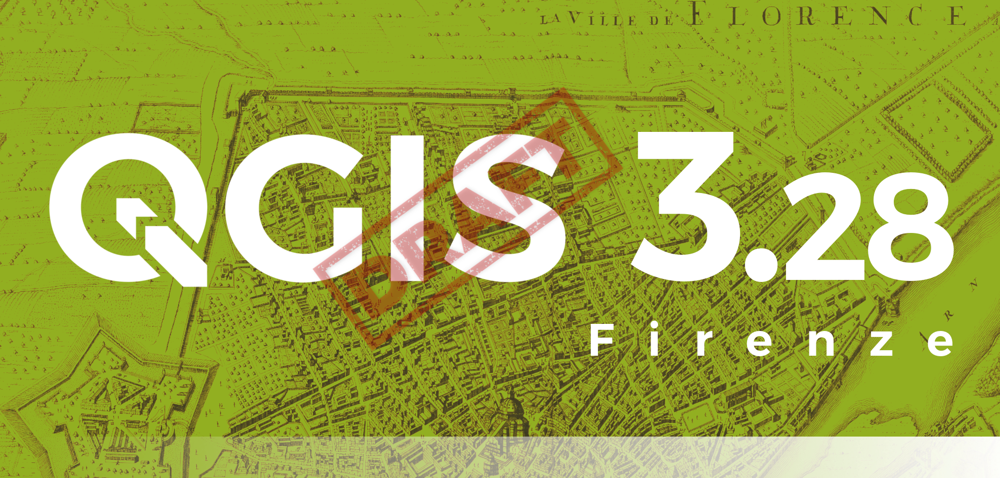
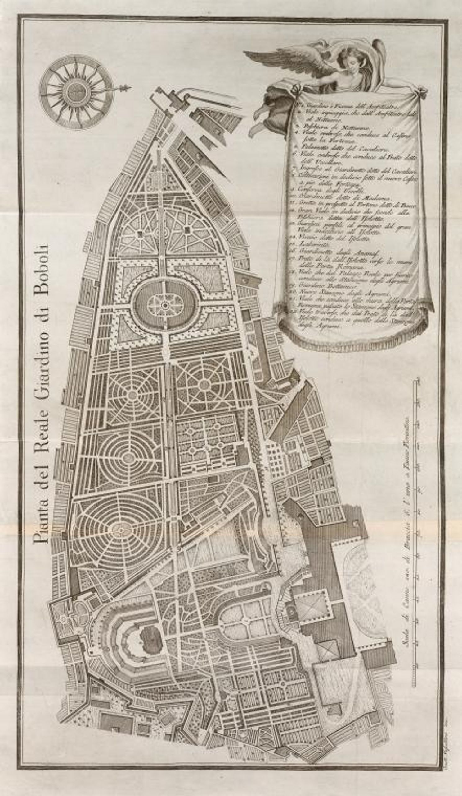
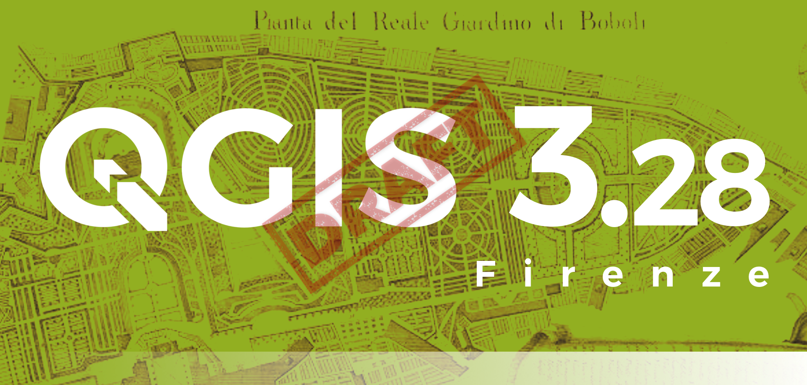
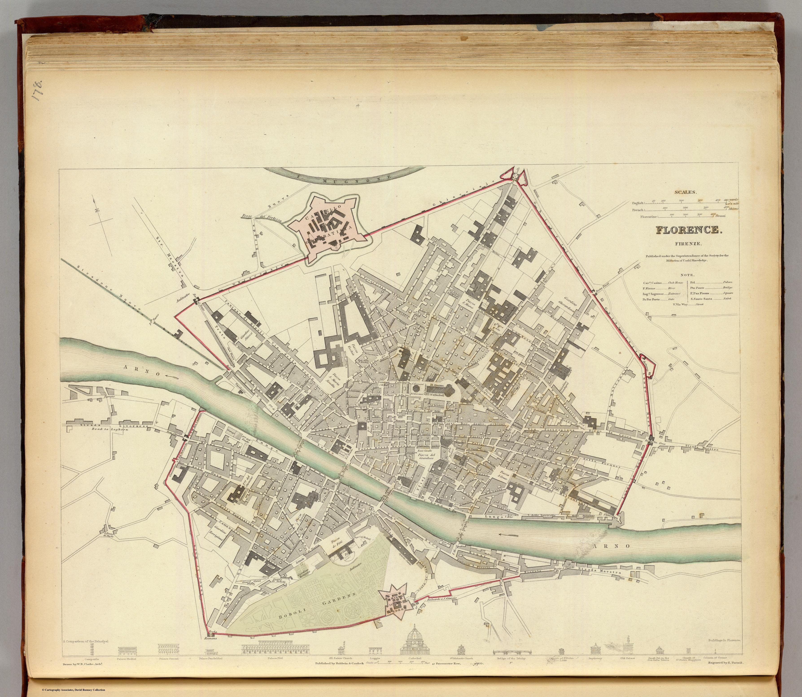
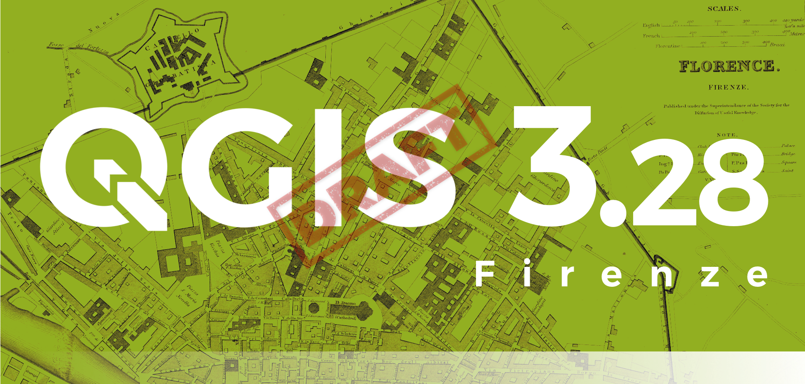

# splashscreen_QGIS328_Firenze

Splashscreen **QGIS 3.28 Firenze** - Backgrounds and GIMP project

-------> **proposals are accepted until Saturday 17 September at 11:59 pm** <-------

<!-- TOC -->

- [splashscreen_QGIS328_Firenze](#splashscreen_qgis328_firenze)
  - [background image requirements](#background-image-requirements)
  - [documentation](#documentation)
  - [repository folders](#repository-folders)
- [Draft](#draft)
  - [First draft (Totò)](#first-draft-totò)
  - [Second draft (Iacopo)](#second-draft-iacopo)
  - [Third draft (Skampus)](#third-draft-skampus)
  - [Fourth draft (Skampus)](#fourth-draft-skampus)
  - [Fifth draft (Skampus)](#fifth-draft-skampus)
  - [Sixth draft (Skampus)](#sixth-draft-skampus)

<!-- /TOC -->

## background image requirements

1. license in the Public domain (required); 
2. high resolution image (required) ~ 3000 px wide; 
3. represents a history map of the city of Florence;
4. The writing Firenze clearly in evidence in the image;

## documentation

1. link to the image;
2. link to the license;
3. link to image description

## repository folders
1. **imagesHR**: contains high resolution images;
2. **imagesLR**: Contains low resolution images as screenshots and splashscreen examples
3. **projectGIMP**: contains the GIMP project files

# Draft 

## First draft (Totò)

- Image

- Link

<https://commons.wikimedia.org/wiki/File:1847_Molini_Pocket_Map_of_Florence_(Frienze),_Italy_-_Geographicus_-_Firenze-molini-1847.jpg>

- Splashscreen

- Description

A rare and extraordinary 1847 map of Firenze or Florence, Italy by Giuseppe Molini. This magnificently engraved map was originally drawn in 1731 by the Florentine architect Ferdinando Ruggieri. Oriented to the south, the map covers the old walled center of Florence as it extends on both sides of the Arno River. Offers superb detail at the street and building level showing towers, gardens, piazzas, palaces and in many cases individual trees. The title appears in a decorative frame in the upper left quadrant. Upper right quadrant features the lily symbol of Florence. An allegorical title cartouche in the lower left quadrant depicts a partially disrobed man leaning against a large urn with a lion, a popular Florentine icon called Marzocco, as his companion. Behind him are tall reeds partially blocking a magnificent view of the Palazzo Vecchio and the Duomo. Though printed in 1847 this map has been prepared in the 17th century style, by copperplate engraving, on thick laid paper. Firenze in 1847 was on the cusp of political transformation. One year following the production of this rare map the Grand Duke of Tuscany, responding to political demonstrations throughout Florence, granted a Tuscany its first constitution.

- Project GIMP

[here](projectGIMP/splash328.xcf)

↑ [come back up](#splashscreen_qgis328_firenze) ↑

## Second draft (Iacopo)

- Image

- Link

<https://commons.wikimedia.org/wiki/File:Florence_-_View_with_Chain_-_woodcut.png#filehistory>

- Splashscreen

- Description

The Veduta della Catena (Chain Map) is the first general view of a city drawn according with the principle of central perspective. The original version was probably realised by Francesco di Lorenzo Rosselli in 1471-72, but was unfortunately lost. The actual copies are old reproductions preserved in various historical archives.
The view shows a detailed image of the city from the Monteoliveto monastery. It constitutes a milestone in the history of cartographic representation as first attempt to use the mathematical theories by Paolo dal Pozzo Toscanelli and the correlated experience of Leon Battista Alberti in formalizing the rules of central perspective as written in the text “De pictura” in 1435. Substantially the rules of triangulation and the concept of representation in scale are already present in a nutshell in this work, making it of capital importance for the geographical representation.

- Project GIMP

[here](projectGIMP/splash328Iacopo.xcf)

↑ [come back up](#splashscreen_qgis328_firenze) ↑

## Third draft (Skampus)

- Image

- Link

<https://curiosity.lib.harvard.edu/scanned-maps/catalog/44-990105957300203941>  
[Licenza](imagesHR/permission_using_Harvard_Map_Collection.pdf)

- Splashscreen

- Description

FLORENTIA PULCHERRIMA ETRURIAE CIVITAS  
Perspective plan of the city of Florence, with the Arno River flowing from the lower left to the upper right, where two cherubs hold up the city's coat of arms. Top left is a legend with 17 entries concerning the Fortezza da Basso; bottom is the main legend with 228 entries in three columns.  
Along the two side margins are distributed 10 vignettes depicting, from right to left:On either side of the image are 10 small views, depicting one the monument of Cosimo I on horseback, one the Duomo with its bell tower, one of the side access roads to Piazza dell'Annunziata with the same in the background, and the other seven Florentine games taking place in various parts of the city.  
Based on Stefano Bonsignori's 1584 model, the plan is engraved by Wenzel Hollar, a painter and engraver from Prague, around 1660. Hollar's view was reissued in Amsterdam in 1700 by Frederick de Wit; the same image is also found in Giovanni Michele Bruto's Historia fiorentina and Giovanni Giorgio Grevio's Thesaurus antiquitatum et historiarum Italiae, Leiden 1723. Copperplate engraving, impressed on two sheets joined at center, small restored woodworm holes in upper white margin, overall in very good condition.

CREATOR/CONTRIBUTOR: Wit, Frederik de., creator  
CREATION DATE: 1695  
PLACE OF ORIGIN: Netherlands, Amstelodami  
PUBLISHER: Frederick de Wit  
EXTENT: 1 map : col. ; 44 x 52 cm., on sheet 48 x 76 cm.  
LANGUAGE: Italian  

- Project GIMP

[here](projectGIMP/harvard_splash328_stefano.xcf)

↑ [come back up](#splashscreen_qgis328_firenze) ↑

## Fourth draft (Skampus)

- Image

- Link

<https://www.uu.nl/en/special-collections/collections/maps-and-atlases/town-plans/italian-town-atlases-by-blaeu>  
[Licenza](imagesHR/permission_%20using_Italian_town_atlases_Blaeu.pdf)

- Splashscreen 1  
Proposta 1  
  
  
- Splashscreen 2  
Proposta 2  
  

- Description  
ITALIAN TOWN ATLASES BY BLAEU (1662, 1704 Edition)  
The Blaeu company is known primarily for its multi-volume atlas of the world known as Atlas Maior. In 1662, Joan Blaeu eventually published this atlas in its most extensive form with no fewer than eleven volumes. At the same time, he planned the publication of a second mega atlas which would be a multi-volume atlas of the cities and monuments of Italy, entitled the Theatrum civitatum et admirandorum Italiæ. In this, he took advantage of the trend of the Grand Tour, the study and knowledge journeys undertaken – usually to Italy – by the young elite.  
Three instead of ten volumes Blaeu originally wanted to put two five-volume parts on the market. The first part, entitled Civitates Italiæ, was to cover the Italian cities. The focus of the second part, entitled Admiranda Urbis Romæ, was to be Rome’s monuments.  
He ultimately only managed to publish three volumes in 1663: the volume on the cities of the Vatican State (part 1, volume 1), an incomplete volume on the cities of Naples and Sicily and a volume on the circuses and theatres of Rome (part 2, volume 1).
During his youth, Joan Blaeu travelled extensively in Italy, establishing reliable contacts along the way. Around 1660, when his plans for an Italian city atlas acquired form, he sent his son Pieter to Italy to breathe new life into these contacts. It was via his Italian contacts that Blaeu acquired the source material for the atlas. The main supplier of the illustrations and texts was the Italian philosopher and lawyer Carlo-Emanuele Vizzani (1617-1661). The texts on the reverse of the maps and prints also refer to other sources.  
There is also evidence that Blaeu had to rely on older works due to a lack of up-to-date information, including the town maps from the Civitates Orbis Terrarum by Braun & Hogenberg. In 1682, the Blaeu heirs added another two volumes to the town atlas, namely those of Savoy and Piedmont. In 1697 and 1700, the bookseller Adriaen Moetjens, who lived in The Hague, republished these last two parts, with one in Dutch and the other in French.
In 1704 or 1705, the Amsterdam-based publisher Pieter Mortier obtained a large amount of the copper plates of Blaeu's Italian city atlases. He reprinted the Blaeu maps and used them to compile an atlas in four volumes which was published in three languages (i.e. Latin, French and Dutch).  
Many of the copper plates were changed or improved and many were given Mortier's imprint. Some plates were even completely retouched. Pieter Mortier also used new copper plates which were engraved in his own atelier. According to a catalogue of new titles, the three different editions of Mortier's publication of town atlases had been completed before the beginning of 1706. Mortier refers to the maps, town profiles and topographic prints individually in a book sales catalogue from around 1705.
The four Mortier volumes concern:
Lombardy (new plates);  
The Vatican State (republication 1663, several new plates);  
Naples and Sicily (republication 1663);  
Monuments of Rome (republication 1663, with various plates from the other volumes).

- Project GIMP

[here 1](projectGIMP/bauer_splash328.xcf)    
[here 2](projectGIMP/bauer_1_splash328.xcf)  

    
## Fifth draft (Skampus)

- Image

- Link

<https://digitalcollections.nypl.org/items/510d47dc-84e2-a3d9-e040-e00a18064a99>  
Licennce: public domain  

- Splashscreen 
    
  
  
- Description  
TITLE: Il reale giardino di Boboli nella sua pianta e nelle sue statue di Francesco Maria Soldini    
NAMES: Soldini, Francesco Maria (Author) and Vascellini, Gaetano, 1745-1805 (Artist)  
DATES / ORIGIN: Date Issued: 1789 in Firenze  
LIBRARY LOCATIONS: The Miriam and Ira D. Wallach Division of Art, Prints and Photographs: Art & Architecture Collection Shelf locator: MEM V329sr (Soldini, F. M. Reale giardino di Boboli)  
PHYSICAL DESCRIPTION: Engravings, Extent: 38 x 60 cm  
LANGUAGES: Italian  
IDENTIFIERS: New York Public Library (NYPL) catalog ID (B-number): b13991127; Universal Unique Identifier (UUID): 075696d0-c6db-012f-1d58-58d385a7bc34  
RIGHTS STATEMENT: The New York Public Library believes that this item is in the public domain under the laws of the United States, but did not make a determination as to its copyright status under the copyright laws of other countries. This item may not be in the public domain under the laws of other countries. Though not required, if you want to credit us as the source, please use the following statement, "From The New York Public Library," and provide a link back to the item on our Digital Collections site. Doing so helps us track how our collection is used and helps justify freely releasing even more content in the future.

- Project GIMP

[here](projectGIMP/Boboli_splash328.xcf)    

## Sixth draft (Skampus)

- Image

- Link

[David Rumsey map collection]<https://www.davidrumsey.com/luna/servlet/s/2od13d>  
[Licence here](https://www.davidrumsey.com/about/copyright-and-permissions)  

- Splashscreen 
    
  
  
- Description  
Title: Florence. Firenze. Published under the superintendence of the Society for the Diffusion of Useful Knowledge. Drawn by W.B. Clarke, Archt. Engraved by E. Turrell. Published Baldwin & Cradock, 47 Paternoster Row, 1835. (London: Chapman & Hall, 1844)    
Author: Society for the Diffusion of Useful Knowledge (Great Britain)  
Date: 1835  
Publisher: Chapman and Hall Publisher, London  
Size: 28 cm x 38 cm    
Scale: 1:9,000  
Pub Date: 1844  
Pub Title: Maps of the Society for the Diffusion of Useful Knowledge. Vol. 1. London: Chapman and Hall, 186, Strand, 1844  
Note: The SDUK, as the Society was known, produced inexpensive maps to encourage broad use in education. The maps in these two volumes were issued in parts over several years. The city plans are of particular interest, with vignettes and great detail. The gnomonic star maps were issued separately in this edition in their own covers. This is the second edition, the first being by Baldwin and Cradock, with the maps issued in numbers and later bound as a set. Rumsey Collection copy originally issued without the 6 "World on a gnomonic projection" maps; copies of them have been laid in. Atlas is bound in half leather dark brown cloth covered boards with "Maps. Vol. 1," "Maps. Vol. 2" stamped in gold on the spines. Maps with outline color; geological map of England and Wales hand colored in full color.  
Collection: Rumsey Collection  

- Project GIMP

[here](projectGIMP/pianta_firenze_1835.zip)    
  
↑ [come back up](#splashscreen_qgis328_firenze) ↑
